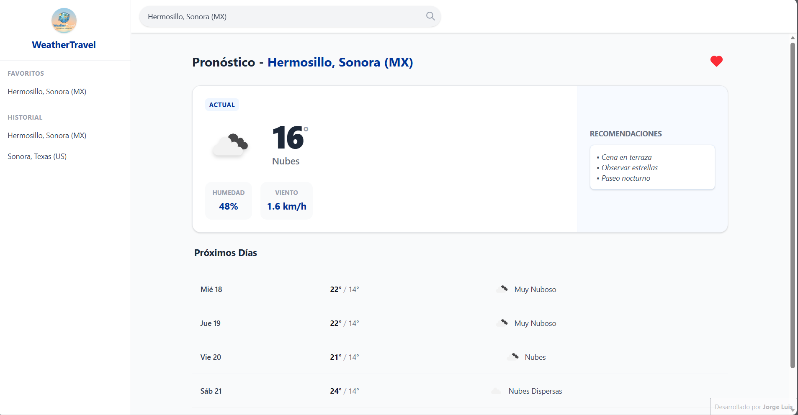

# WeatherTravel

**Enlace del proyecto:** [Visitar WeatherTravel](https://weather-travel.vercel.app)

**WeatherTravel** es una aplicación web responsiva de pronóstico del tiempo que prioriza la experiencia del usuario y la persistencia de datos.

## Características principales

- **Búsqueda Inteligente:** Sistema de autocompletado de ciudades con optimización de peticiones.
- **Persistencia de Datos:** Uso de `localStorage` para mantener favoritos e historial de búsqueda.
- **Diseño Responsivo:** Interfaz adaptativa con sidebar dinámico (Mobile & Desktop).
- **Semántica y Animaciones:** Estructura en HTML5 con transiciones y animaciones fluidas en CSS3.

## Tecnologías utilizadas

* **HTML5 Semántico**
* **CSS3 (Tailwind CSS)** * **JavaScript (Vanilla ES6+)**
* **OpenWeatherMap API**

## Instalación y configuración

1. **Clonar el repositorio:**
   ```bash
   git clone https://github.com/Jorgedr12/weather-travel.git
   cd WeatherAPI
    ```

2.  **Configurar la API Key:**
    El proyecto necesita una llave de API de OpenWeatherMap para funcionar.
    
    * Regístrate en [OpenWeatherMap](https://openweathermap.org/) y obtén tu **API Key** gratuita.
    * En la carpeta `js/`, localiza el archivo `config.example.js`.
    * Renombra este archivo a `config.js`.
    * Pega tu llave dentro del archivo.

    > **Nota:** El archivo `config.js` está incluido en el `.gitignore` para proteger tu llave.

## Vista previa

A continuación se muestra una vista de la interfaz de usuario:

